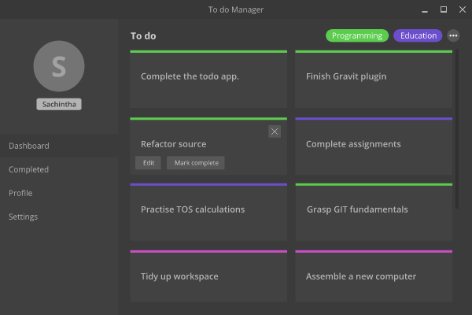

# Todo Manager

__Work In Progress__

A desktop app for easy todo management developed using ElectronJS and AngularJS.


UI Mockup

## Development

1. Clone source files

    ``` git clone https://github.com/devsrg/todo-manager.git ```

2. Install required dependencies

    ``` npm install ```

## LICENSE

MIT &copy; DevSRG