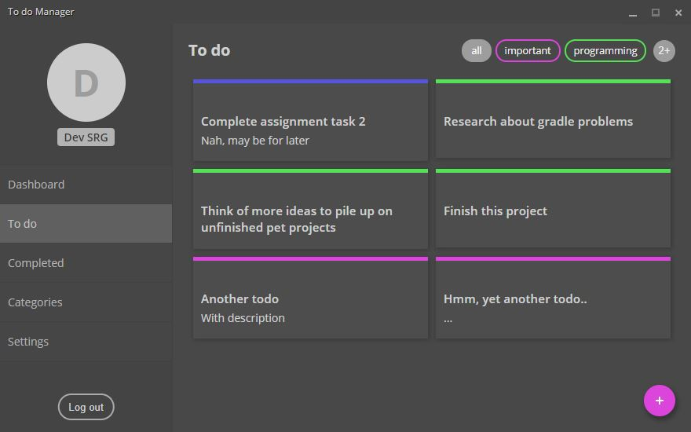

# Todo Manager

A desktop app for easy todo management developed using nodeJS, Electron and AngularJS. Using old school javascript and frameworks to stay in line with initial codes. This is being developed as a pet project so do not use for anything important. _Work In Progress_ (forever...)


UI based on updated _final_v1_ branch.

## Development

1. Clone source files.

    ``` git clone https://github.com/devsrg/todo-manager.git ```

2. Install required dependencies.

    ``` npm install ```

## LICENSE

MIT &copy; devSRG
